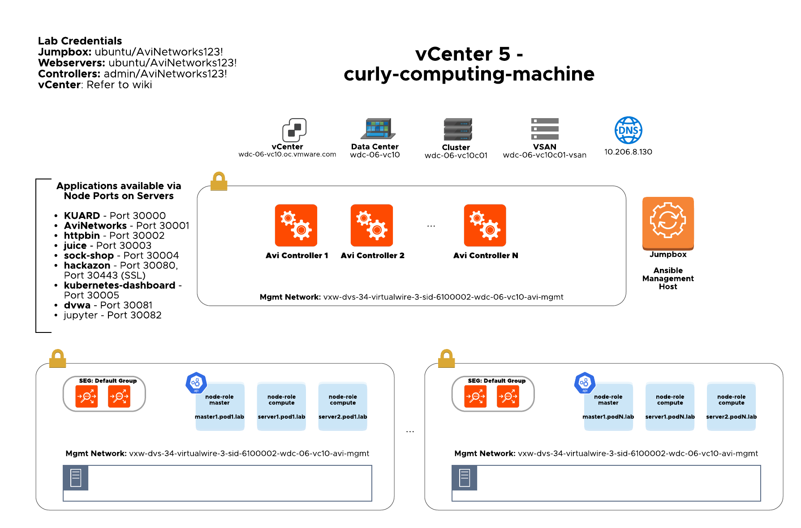

# curly-computing-machine

## Solution Overview

Extensible deployment framework starting from the infrastructure layer covered by Terraform up to the configuration management handled by Ansible.

The current repo deploys n-number of target K8S pods with VMware NSX Advanced Load Balancer (Avi Networks) as Ingress Controller on top of vSphere.

## Topology



### Applications

Applications available via Node Ports on Servers. Ingress automation is available optionally.

  - KUARD - Port 30000
  - avinetworks - Port 30001
  - httpbin - Port 30002
  - juice - Port 30003
  - sock-shop - Port 30004
  - hackazon - Port 30080, Port 30443 (SSL)
  - kubernetes-dashboard - Port 30005
  - dvwa - Port 30081
  - jupyter - Port 30082

## Requirements

 - Terraform >= 0.12.10
 - Ansible >= 2.9.2
 - vCenter (tested starting 6.5+)
 - Ubuntu OVA image imported as VM template. Ubuntu VM template has to support user-data, please download official Ubuntu OVA image from https://cloud-images.ubuntu.com/bionic/current/
 - Avi Controller image (18.2.6+) imported as VM template
 - DHCP is required for Management Port Group to bootstrap the virtual machines as well as Internet connectivity

     **NOTE**: all the deployment work was performed within avitools container: [https://github.com/avinetworks/avitools](https://github.com/avinetworks/avitools)

## Getting Started

      **NOTE**: all the deployment work was performed within avitools container: [https://github.com/avinetworks/avitools](https://github.com/avinetworks/avitools)

 1. Clone the repository - [https://github.com/smarunich/curly-computing-machine](https://github.com/smarunich/curly-computing-machine)

```
root@avitools:~# git clone https://github.com/smarunich/curly-computing-machine
Cloning into ‘curly-computing-machine'...
```

 2. Initialize a Terraform working directory
 ```
root@avitools:~/curly-computing-machine# terraform init
Initializing the
backend... Initializing provider plugins... Checking for available
provider plugins...

* provider.local: version = "~> 1.4"
* provider.random: version = "~> 2.2"
* provider.template: version = "~> 2.1"
* provider.tls: version = "~> 2.1"
* provider.vsphere: version = "~> 1.17"

Terraform has been successfully initialized!
```
3. Copy the minimum required variables template
```
root@avitools:~/curly-computing-machine# cp sample_terraform_tfvars terraform.tfvars
```
4. Fill out the required variables - terraform.tfvars

    **NOTE**: Avi Controller AMI must be shared with the target AWS account
```
#terraform.tfvars
vsphere_server = ""
vsphere_user = ""
vsphere_password = ""
avi_admin_password = "AviNetworks123!"
avi_default_password = "58NFaGDJm(PJH0G"
avi_backup_admin_username = "aviadmin"
avi_backup_admin_password = "AviNetworks123!"
pod_count = 2
id = "magicenable"
dns_server = ""
dc = "dc01"
cluster = "cluster01"
datastore = "vsan"
network = "pg-mgmt"
vip_ipam_cidr = "10.206.40.0/22"
vip_ipam_allocation_range = "10.206.41.1-10.206.41.40"
```
5. Update vars_pod.tf with appropriate VM template names for jumpbox, server and controller objects
```
variable "controller" {
  type = map
  default = {
    cpu = 8
    memory = 24768
    disk = 128
    template = "controller-18.2.6-9134-template"
  # mgmt_ip = ""
  # mgmt_mask = ""
  # default_gw = ""
  }
}

variable "jumpbox" {
  type = map
  default = {
    cpu = 2
    memory = 4096
    disk = 20
    # The image must support user-data, https://cloud-images.ubuntu.com/bionic/current/
    template = "ubuntu-bionic-18.04-cloudimg-20200407"
  # mgmt_ip = ""
  # mgmt_mask = ""
  # default_gw = ""
  }
}

variable "server" {
  type = map
  default = {
    cpu = 2
    memory = 4096
    disk = 60
    # The image must support user-data, https://cloud-images.ubuntu.com/bionic/current/
    template = "ubuntu-bionic-18.04-cloudimg-20200407"
  # mgmt_ip = ""
  # mgmt_mask = ""
  # default_gw = ""
  }
```
6. Prepare the terraform plan
```
root@avitools:~/curly-computing-machine# terraform plan

…

Plan: 74 to add, 0 to change, 0 to destroy.
------------------------------------------------------------------------
Note: You didn't specify an "-out" parameter to save this plan, so
Terraform can't guarantee that exactly these actions will be performed
if "terraform apply" is subsequently run
7. Apply the terraform plan
aviadmin@avitools:~/curly-computing-machine# terraform apply

…
Plan: 74 to add, 0 to change, 0 to destroy.
Do you want to perform these actions?   Terraform will perform the
actions described above.   Only 'yes' will be accepted to approve.

Enter a value: yes

...

Apply complete! Resources: 40 added, 0 changed, 0 destroyed.

Outputs:
Controller_PublicIP = [
"54.188.71.166",
"54.185.115.180",
]
Jumpbox_PublicIP = 54.202.241.121
Master_PublicIP = [
"34.213.245.110",
"34.221.24.201",
]
8. Review the environment details
aviadmin@avitools:~/curly-computing-machine# terraform output
 Controller_PublicIP = [
"54.188.71.166",
"54.185.115.180",
]
Jumpbox_PublicIP = 54.202.241.121
Master_PublicIP = [
"34.213.245.110",
"34.221.24.201",
]
```
9. SSH into the environment
```
 aviadmin@avitools:~/curly-computing-machine# ls keys/
generated-access-key-polecat.pem  generated-access-key-polecat.pub
 aviadmin@avitools:~/curly-computing-machine# ssh -i keys/generated-access-key-polecat.pem 54.202.241.121 -l ubuntu
 ```
10. (Optional) Check the registered inventory
```
ubuntu@jumpbox:~$ cat /etc/hosts
...
172.20.0.202	jumpbox.pod.lab
54.202.241.121	public.jumpbox.pod.lab
172.20.1.157	master1.pod2.lab
34.221.24.201	public.master1.pod2.lab
172.20.1.127	server2.pod2.lab
50.112.180.171	public.server2.pod2.lab
172.20.1.134	master1.pod1.lab
34.213.245.110	public.master1.pod1.lab
172.20.1.244	server2.pod1.lab
52.43.221.124	public.server2.pod1.lab
172.20.1.30	server1.pod2.lab
54.185.175.111	public.server1.pod2.lab
172.20.0.31	controller.pod2.lab
54.185.115.180	public.controller.pod2.lab
172.20.0.130	controller.pod1.lab
54.188.71.166	public.controller.pod1.lab
172.20.1.247	server1.pod1.lab
54.201.30.215	public.server1.pod1.lab
ubuntu@jumpbox:~$ /etc/ansible/hosts --list
```
